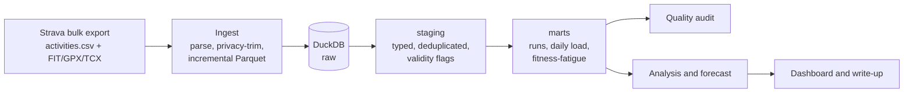

# Riyadh 10K Forecast

**Can I predict my Riyadh Marathon 10K time from my own training data, and what actually drives my performance?**

On 30 January 2027 I race the 10K at the Riyadh Marathon with a sub-50-minute goal. This project turns
my full Strava history into a tested analytics pipeline, investigates what drives my running
performance, and publishes a forecast with a prediction interval **before** race day. After the race, the
forecast is scored against the real result.

> Status: **Week 1 of 12, pipeline foundation.** Findings are added chapter by chapter below.

## Why this project is built the way it is

| Concern | Decision |
|---|---|
| Completeness | Strava **bulk export** instead of the API: full history, raw second-by-second streams, no rate limits |
| Reproducibility | One command rebuilds everything from the export: `make data` |
| Trust | A data-quality audit runs on every build and fails it on real errors ([report](reports/data_quality.md)) |
| Privacy | GPS within 500 m of every start and finish is deleted **at ingestion**, so it never reaches the warehouse or this repo |
| Honesty | n = 1 observational data. Findings are stated as associations with their limitations, not as causes |

## Architecture



Stack: Python, pandas, DuckDB (SQL models), fitdecode/gpxpy, pytest, GitHub Actions.
Full table and metric definitions: [docs/data_model.md](docs/data_model.md).

## Quickstart

```bash
git clone <this repo> && cd riyadh-10k-forecast
python -m venv .venv && source .venv/bin/activate
make install

# Try it without any personal data: synthetic 16-week training block with planted data problems
make sample
runlab --config config.sample.yaml summary
```

To run on your own data:

1. Strava → Settings → My Account → *Download or Delete Your Account* → **Request your archive**.
2. Unzip it into `data/raw/strava_export/` (so `data/raw/strava_export/activities.csv` exists).
3. Set `hr_max`, `hr_rest` and `timezones` in `config.yaml`.
4. `make data`, then `make summary`.

Weekly refresh: download a new archive, replace the folder, run `make data`. Already-parsed
activities are cached, so only new runs are processed.

## Roadmap

- [x] **Week 1: Foundation.** Ingestion for FIT/GPX/TCX, privacy trimming, DuckDB warehouse,
      training load (TRIMP, fitness-fatigue, ACWR), 13-check quality audit, tests, CI
- [ ] **Weeks 2–3:** historical weather join (Open-Meteo), heat index per run, first real-data audit
- [ ] **Weeks 4–5:** exploratory analysis and training-load chapter
- [ ] **Weeks 6–7:** aerobic efficiency, heat penalty model, intensity distribution
- [ ] **Weeks 8–9:** race-time model, backtest, interim forecast published
- [ ] **Weeks 10–11:** interactive dashboard (Streamlit) and Power BI version
- [ ] **Week 12:** full case-study write-up
- [ ] **~20 Jan 2027:** final forecast published
- [ ] **30 Jan 2027:** race. **Early Feb:** forecast scored against the result

## Findings

_Chapters are published here as they are completed._

1. Data quality: what's wrong with my wrist-sensor data, measured (Week 4)
2. Training load: how fit, how fatigued, and when
3. Aerobic efficiency: am I actually getting fitter?
4. The heat penalty: what Riyadh summers cost per kilometre
5. Intensity distribution
6. The forecast
7. Limitations

## Project structure

```
config.yaml               athlete values, timezones, privacy, quality thresholds
src/runlab/
  ingest/                 activities.csv + stream parsers, incremental pipeline
  sql/staging, sql/marts  SQL models, executed in filename order
  models/load.py          fitness-fatigue and ACWR
  quality.py              data-quality checks and report
  privacy.py              start/finish GPS trimming
  cli.py                  runlab ingest | build | quality | all | summary
scripts/make_sample_export.py   synthetic export for demos and CI
tests/                    unit tests and an end-to-end pipeline test
```

## Author

Sikander Ali Khan · Riyadh
