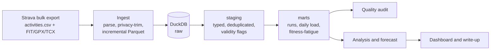
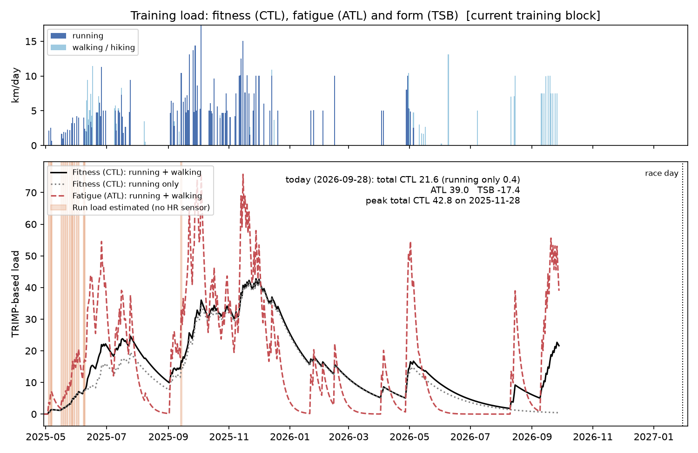
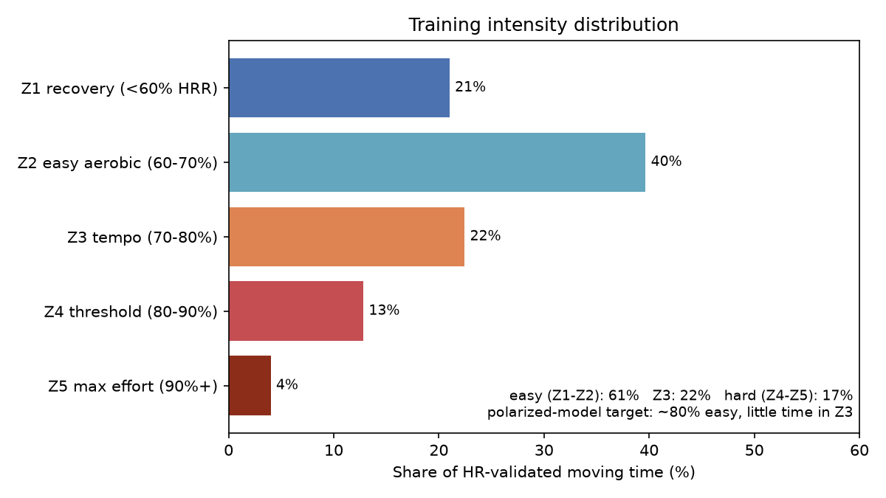
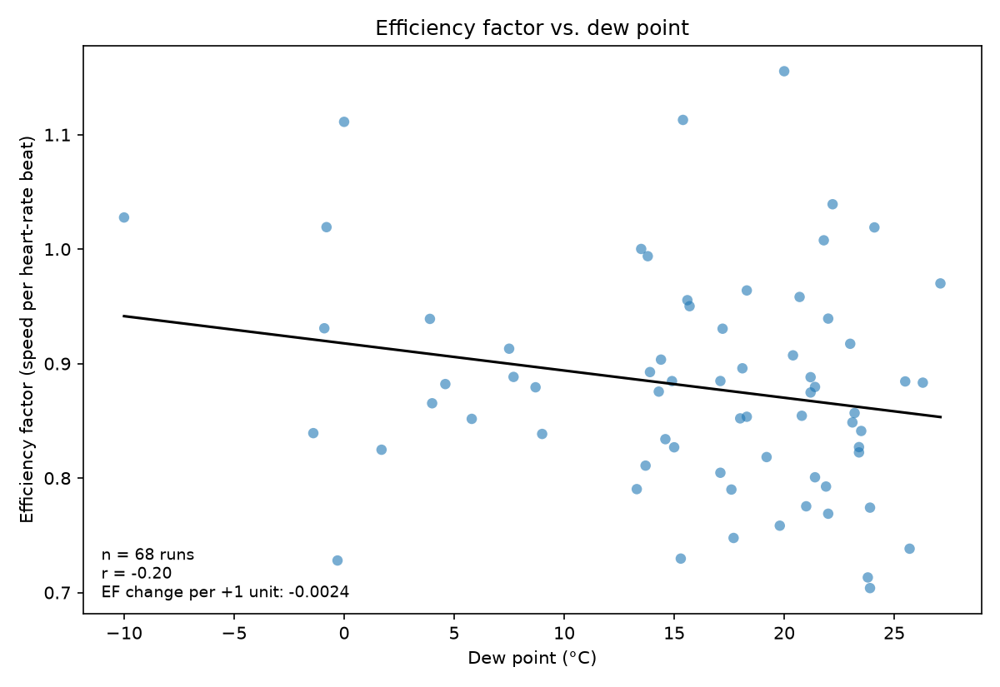
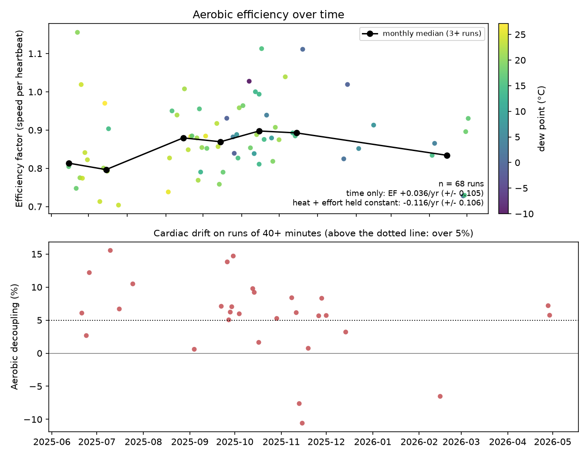
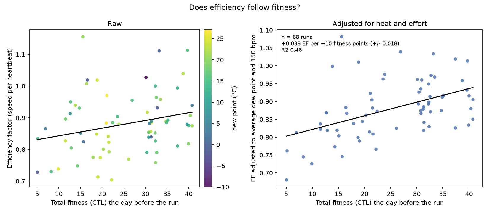

# Riyadh 10K Forecast

**Can I predict my Riyadh Marathon 10K time from my own training data, and what actually drives my performance?**

On 30 January 2027 I race the 10K at the Riyadh Marathon with a sub-50-minute goal. This project turns
my full Strava history into a tested analytics pipeline, investigates what drives my running
performance, and publishes a forecast with a prediction interval **before** race day. After the race, the
forecast is scored against the real result.

> Status: **Week 1 of 12, pipeline foundation.** Findings are added chapter by chapter below.

## Why this project is built the way it is

| Concern | Decision |
|---|---|
| Completeness | Strava **bulk export** instead of the API: full history, raw second-by-second streams, no rate limits |
| Reproducibility | One command rebuilds everything from the export: `make data` |
| Trust | A data-quality audit runs on every build and fails it on real errors ([report](reports/data_quality.md)) |
| Privacy | GPS within 500 m of every start and finish is deleted **at ingestion**, so it never reaches the warehouse or this repo |
| Honesty | n = 1 observational data. Findings are stated as associations with their limitations, not as causes |

## Architecture



Stack: Python, pandas, DuckDB (SQL models), fitdecode/gpxpy, pytest, GitHub Actions.
Full table and metric definitions: [docs/data_model.md](docs/data_model.md).

## Quickstart

```bash
git clone <this repo> && cd riyadh-10k-forecast
python -m venv .venv && source .venv/bin/activate
make install

# Try it without any personal data: synthetic 16-week training block with planted data problems
make sample
runlab --config config.sample.yaml summary
```

To run on your own data:

1. Strava → Settings → My Account → *Download or Delete Your Account* → **Request your archive**.
2. Unzip it into `data/raw/strava_export/` (so `data/raw/strava_export/activities.csv` exists).
3. Set `hr_max`, `hr_rest` and `timezones` in `config.yaml`.
4. `make data`, then `make summary`.

Weekly refresh: download a new archive, replace the folder, run `make data`. Already-parsed
activities are cached, so only new runs are processed.

## Roadmap

- [x] **Week 1: Foundation.** Ingestion for FIT/GPX/TCX, privacy trimming, DuckDB warehouse,
      training load (TRIMP, fitness-fatigue, ACWR), 16-check quality audit, tests, CI
- [x] **Weeks 2–3:** historical weather join (Open-Meteo), device-duplicate and sparse-speed bugs found and fixed
- [x] **Weeks 4–5:** exploratory analysis and training-load chapter
- [x] **Weeks 6–7:** heat penalty model (weak/inconclusive, documented), intensity distribution
- [x] **Also done:** aerobic-efficiency trend (inconclusive as a straight line, documented)
- [ ] **Weeks 8–9:** race-time model, backtest, interim forecast published
- [ ] **Weeks 10–11:** interactive dashboard (Streamlit) and Power BI version
- [ ] **Week 12:** full case-study write-up
- [ ] **~20 Jan 2027:** final forecast published
- [ ] **30 Jan 2027:** race. **Early Feb:** forecast scored against the result

## Findings

_Chapters are published here as they are completed._

1. [Data quality](reports/data_quality.md): 290 Strava activities checked by 16 automated audits. Three real-data bugs were found by testing hypotheses against raw readings, then fixed: 74 duplicate uploads (a phone app plus a GPS-less band), placeholder speed values from the band, and sparse speed values that erased moving time and produced impossible 1:30/km paces
2. [Training load](reports/figures/training_load.png): training came in bursts. Fitness (CTL) peaked at 42.8 on 28 November 2025, mostly from running, and decayed to about 5 by April 2026; running stopped after 5 May 2026. Since August, walking at zone 2 heart rates has rebuilt total aerobic fitness to 21.6 (as of 28 September 2026), about half the peak, while running-only fitness sits near zero (0.4). Walking builds the aerobic base but not the impact tolerance of running, so the chart shows both curves. Load on 20 days without heart-rate data (mostly a May-June 2025 Nike Run Club block) was estimated from pace, which lifted running fitness from 17.2 to 20.3 in September 2025
3. [Aerobic efficiency](reports/figures/aerobic_efficiency.png): inconclusive as a straight-line trend. Across 68 comparable runs, efficiency changed by +0.04 per year on its own and -0.12 per year holding dew point and heart rate constant, each with a margin of about 0.1, so improvement cannot be told apart from decline. Monthly medians say more: about 0.80 in June-July 2025, 0.87-0.90 from September to December 2025 (roughly 45 seconds per km faster at 150 bpm, partly from cooler, drier weather), then 0.83 in April 2026 (5 runs). Fitness built and faded in bursts, which a straight line cannot capture. Heart-rate drift on 30 runs of 40+ minutes had a median of 6.1%, just above the 5% guideline Measured against fitness instead of the calendar the signal is clearer: +0.038 efficiency per +10 fitness points holding heat and effort constant (margin 0.018, optimistic because nearby runs share almost the same fitness), about 19 seconds per km at 150 bpm. Fitness alone explains only about 6% of run-to-run variation, and total and running-only fitness fit about equally, so the history cannot say whether walking fitness carries over to running
4. [Heat and humidity](reports/figures/heat_effect_dew_point_c.png): weak evidence that humidity, not raw temperature, is the stronger drag on efficiency (r = -0.20 vs -0.07), consistent with how sweat evaporation works, but too weak to confirm from a training block concentrated in one narrow, hot-humid range
5. [Intensity distribution](reports/figures/intensity_distribution.png): 61% of heart-rate-validated running time was easy (Z1-Z2) against a polarized target of about 80%, with 22% in the moderate Z3 zone and 17% hard (Z4-Z5). Heat may inflate some of the Z3 share, since heart rate runs higher in hot conditions at the same pace
6. The forecast
7. Limitations

## Figures











## Project structure

```
config.yaml               athlete values, timezones, privacy, quality thresholds
src/runlab/
  ingest/                 activities.csv + stream parsers, incremental pipeline
  sql/staging, sql/marts  SQL models, executed in filename order
  models/load.py          fitness-fatigue and ACWR
  quality.py              data-quality checks and report
  privacy.py              start/finish GPS trimming
  cli.py                  runlab ingest | build | quality | all | summary
scripts/make_sample_export.py   synthetic export for demos and CI
tests/                    unit tests and an end-to-end pipeline test
```

## Author

Sikander Ali Khan · Riyadh
